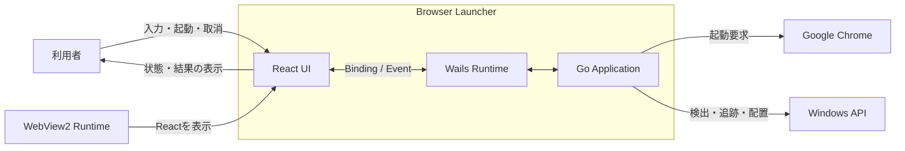
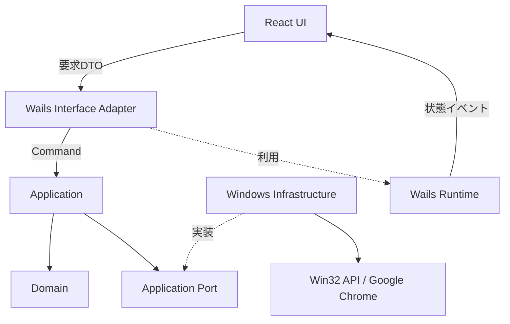
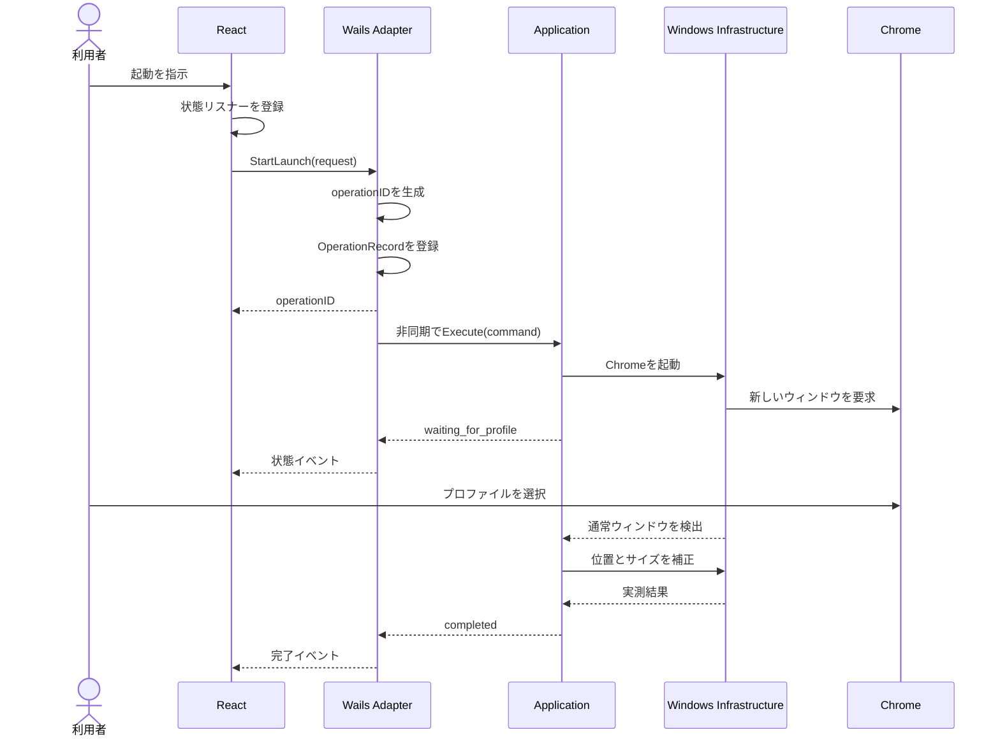
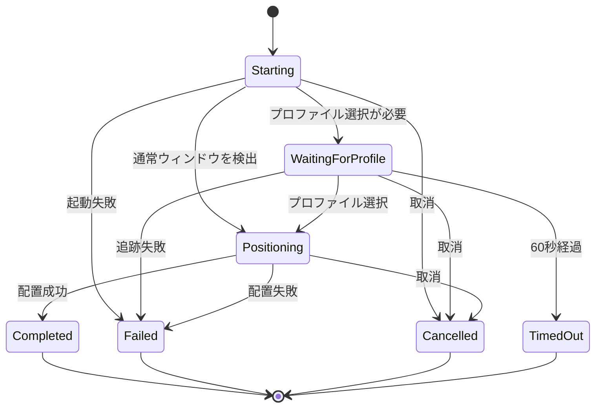

# デスクトップアプリケーション基盤とGo・React連携方式

- Status: Completed
- Date: 2026-07-25
- Related: SCRUM-14
- Decision: [ADR-0003](../adr/0003-use-wails-v2-for-desktop-foundation.md)

## 目的

Browser Launcherのデスクトップアプリケーション基盤と、ReactからGoのApplication層を利用するための連携方式を検討します。

本書で扱う「連携」は、外部ネットワークを経由する通信ではありません。WebView内で動作するReactと、Goの異なる実行環境を接続するプロセス内の境界を指します。

## 本書の位置付け

本書は、Wailsの最小検証前に作成した設計案と検証結果を記録します。採用する設計判断は、[ADR-0003](../adr/0003-use-wails-v2-for-desktop-foundation.md)で確定しました。

| 状態 | 意味 |
| --- | --- |
| 確定済み | プロダクト要件またはADR-0003で決定した |
| 後続決定 | 基盤選定後の設計または実装で決定する |

## 前提

### 検証前に確定済み

- UIにはReactを使用する
- アプリケーションの主要な処理にはGoを使用する
- Windows 11とGoogle Chromeの安定版をMVPの対象とする
- Chromeの起動後、通常のブラウザウィンドウをWin32 APIで追跡して配置する
- プロファイル選択中は待機状態とし、利用者による取消と60秒のタイムアウトを提供する
- DomainとApplicationを、UI、Wails、Windows APIから分離する

### 検証後に確定済み

- デスクトップアプリケーション基盤にWails v2.12.0を使用する
- フロントエンドにReactとTypeScriptを使用する
- ReactからGoへの要求にはWailsのメソッドバインディングを使用する
- GoからReactへの状態通知にはWailsのイベントを使用する
- ローカルHTTPサーバー、WebSocket、待受ポートは使用しない

## システムコンテキスト

状態: 確定済み



WailsとWebView2はUIを実行してGoと接続するための技術詳細です。Chromeの起動、追跡、配置に関するルールはWailsへ持ち込みません。

## 候補の比較

状態: 確定済み

| 候補 | 利点 | 欠点 | 判断 |
| --- | --- | --- | --- |
| Wails v2 | GoとReactを直接統合できる。TypeScript型を生成できる。イベント機構がある。待受ポートが不要 | Wails固有の境界と生成処理へ依存する。WindowsではWebView2 Runtimeが必要 | 推奨 |
| ローカルHTTPとWebSocket | Web標準の技術を使える。UIとGoを別プロセスに分けやすい | ポート、Origin、認証、起動順序、終了処理を設計する必要がある | MVPでは採用しない |
| WebView2の直接統合 | Windows固有機能を細かく制御できる | WebViewのライフサイクルとJavaScript連携を実装する必要があり、Goとの統合が複雑になる | 採用しない |
| Wails v3 | 新しいAPIとデスクトップ機能を利用できる | 2026年7月時点でAlphaと明記されている | MVPでは採用しない |

Wails v2は、ReactとGoの連携に必要な機能を提供し、本プロジェクト固有ではない通信基盤の実装を減らせます。Wails固有の型と処理をInterface Adapterへ限定することを採用条件とします。

## アプリケーション内部の構成

状態: 確定済み



実線は処理の呼び出し方向、点線は実装または技術の利用関係を示します。コードの依存は外側から内側へ向けます。Infrastructureは、Application側で定義したPortを実装します。

### React UI

Reactは次を担当します。

- 入力値と画面固有の状態の保持
- 入力形式の補助的な検証
- 起動要求と取消要求の送信
- 進行状態、成功、失敗の表示
- キーボード操作、ラベル、フォーカスなどのアクセシビリティ

使用可能領域の判定、Chromeの検出、ウィンドウ候補の同一性、タイムアウトなどの業務ルールはReactへ実装しません。

### Wails Interface Adapter

Wails Interface Adapterは次を担当します。

- Reactへ公開するメソッドの限定
- DTOとApplicationのCommand・Resultの変換
- Applicationの状態をWailsイベントへ変換
- 内部エラーをUI向けの状態コードへ変換
- 実行中の操作と取消関数の対応付け

Domain型、Application Service、Infrastructure実装をWailsへ直接バインドしません。

### Application

Applicationは次を担当します。

- 起動ユースケースの処理順序
- 起動、プロファイル選択待機、配置の状態遷移
- 利用者による取消
- 60秒のタイムアウト
- Infrastructureの呼び出しと結果の統合

ApplicationはWailsのイベント名やReactの表示文言を知りません。

### Domain

Domainは、ウィンドウ位置とサイズなどの不変条件を扱います。Wails、JSON、WebView2、Win32 APIの型には依存しません。

### Windows Infrastructure

Windows Infrastructureは次を担当します。

- Chromeの検出と起動
- WinEventとポーリングによるウィンドウ追跡
- Win32 APIによる位置とサイズの補正
- DPIとプライマリディスプレイの扱い
- OS固有エラーからApplication向けエラーへの変換

## ReactからGoへの要求

状態: 確定済み

ReactからGoへの要求には、Wailsのメソッドバインディングを使用します。Reactへ公開する型を、仮に`LauncherController`とします。

```go
type LauncherController struct {
    launchUseCase *application.LaunchChrome
    operations    *OperationRegistry
    events        LaunchEventPublisher
}
```

公開するメソッドは、ユースケースの開始、取消、状態取得に限定します。

```go
func (c *LauncherController) StartLaunch(
    request LaunchRequestDTO,
) (StartLaunchResultDTO, error)

func (c *LauncherController) CancelLaunch(
    operationID string,
) CancelLaunchResultDTO

func (c *LauncherController) GetLaunchState(
    operationID string,
) GetLaunchStateResultDTO
```

`StartLaunch`は処理を開始し、操作を識別する`operationID`を返します。`CancelLaunch`は、指定された操作の取消を要求します。`GetLaunchState`は、イベントを受信できなかった場合やReactの再マウント後に、指定された操作の最新状態を返します。

## DTOと型の境界

状態: 確定済み

ReactとGoの境界では、DomainモデルではなくDTOを使用します。

```go
type LaunchRequestDTO struct {
    Width  int `json:"width"`
    Height int `json:"height"`
    X      int `json:"x"`
    Y      int `json:"y"`
}

type StartLaunchResultDTO struct {
    OperationID string `json:"operationId"`
    Status      string `json:"status"`
}

type GetLaunchStateResultDTO struct {
    Found bool                 `json:"found"`
    State *LaunchStateEventDTO `json:"state,omitempty"`
}
```

境界で次の変換を行います。

```text
LaunchRequestDTO
        ↓ 入力形式の確認
Application Command
        ↓ 不変条件の検証
Domain Value
```

Wailsが生成するTypeScript型は通信契約として扱います。Domainモデルの代わりには使用しません。

## 起動処理のフロー

状態: 確定済み



`StartLaunch`の応答と、Application処理の完了を分離します。Reactは長時間のPromiseだけに依存せず、`operationID`に対応する状態イベントを受け取ります。

図中のApplication呼び出しは、Controllerが開始する非同期処理を表します。Controllerは`OperationRecord`を登録して`operationID`を返し、Applicationの完了を待たずにWailsのメソッド呼び出しを終了します。

## 状態通知

状態: 確定済み

GoからReactへの通知には、1つのWailsイベントを使用します。

```text
launcher:state-changed
```

イベントのDTOには、対象操作と状態を含めます。

```go
type LaunchStateEventDTO struct {
    OperationID string `json:"operationId"`
    State       string `json:"state"`
    ErrorCode   string `json:"errorCode,omitempty"`
    Message     string `json:"message,omitempty"`
}
```

状態は限定された値として定義します。

| 状態 | 意味 |
| --- | --- |
| `starting` | 起動処理を開始している |
| `waiting_for_profile` | 利用者のプロファイル選択を待っている |
| `positioning` | 通常ウィンドウの位置とサイズを補正している |
| `completed` | 配置を完了した |
| `cancelled` | 利用者の取消によって終了した |
| `timed_out` | 60秒以内に待機が完了しなかった |
| `failed` | 起動、追跡、配置のいずれかに失敗した |

Reactは、現在保持している`operationID`と一致するイベントだけを画面へ反映します。コンポーネントの破棄時にはイベントリスナーを解除します。

Wailsイベントは一時的な通知として扱い、状態のSingle Source of Truth（SSOT）にはしません。Reactは起動要求を送る前に状態リスナーを登録します。イベントを受信できなかった場合やReactを再マウントした場合は、`GetLaunchState`を呼び出して`OperationRegistry`に保持された最新状態と同期します。

終端状態のイベントを取りこぼしても画面が実行中のまま残らないことを、最小検証で確認します。

## 状態遷移

状態: 確定済み



すべての終了経路で、WinEventフック、タイマー、実行中の操作情報などのリソースを解放します。

## 取消

状態: 確定済み

取消要求はイベントではなく、`operationID`を指定するメソッドとして扱います。

```text
React
  ↓ CancelLaunch(operationID)
Wails Interface Adapter
  ↓ context.CancelFunc()
Application
  ↓ context.Context
Windows Infrastructure
```

明示的なメソッドにすると、次を区別できます。

- 取消要求を受け付けた
- 対象の操作が存在しない
- 対象の操作がすでに完了している
- 対象の操作が取消処理中である

操作は、排他制御を持つレジストリーで管理します。取消関数だけでなく、現在状態と終了結果を保持します。

```go
type OperationRecord struct {
    ID     string
    State  LaunchState
    Cancel context.CancelFunc
    Result *LaunchResult
}

type OperationRegistry struct {
    mu         sync.Mutex
    operations map[string]*OperationRecord
}
```

`OperationRecord`により、実行中、取消処理中、完了済み、存在しない操作を区別します。完了済みの操作は、Reactが最終状態を取得できる期間だけ保持します。保持期間、削除の契機、アプリケーション終了時の破棄方法は最小検証後に決定します。

MVPでは、起動操作の実行中に新しい起動操作を開始しない方針を推奨します。多重実行の扱いは、最小検証後に要件と照合して決定します。

## タイムアウト

状態: 確定済み

60秒のタイムアウトはReactではなく、Application層で`context.Context`を使用して管理します。

```go
ctx, cancel := context.WithTimeout(parent, 60*time.Second)
defer cancel()
```

Application層で管理することで、UIの再描画やイベントリスナーの状態にかかわらず、処理とリソースの終了条件を一貫させられます。

## エラーと結果

状態: 確定済み

エラーを、利用者が対処できる想定内の結果と、予期しない内部失敗に分けます。

### 想定内の結果

- 入力不正
- Chrome未検出
- 利用者による取消
- タイムアウト
- 候補ウィンドウの競合
- 要求した位置とサイズへ配置できない

想定内の結果は、状態コードと利用者向けメッセージを持つDTOへ変換します。

```go
type ErrorDTO struct {
    Code    string `json:"code"`
    Message string `json:"message"`
}
```

### 予期しない内部失敗

- 初期化されていない依存関係
- 内部状態の矛盾
- Interface Adapterで処理できない失敗

失敗の通知経路は、発生した時点で分けます。

| 発生時点 | 対象 | Reactへの通知 |
| --- | --- | --- |
| 開始受付前 | DTOの変換失敗、Controllerの初期化不備、操作を開始できない内部失敗 | `StartLaunch`のPromise rejection |
| 開始後 | Chrome未検出、取消、タイムアウト、候補競合、配置失敗 | 状態コードを持つイベントと`GetLaunchState`の結果 |
| 開始後 | 追跡処理の内部状態矛盾など、予期しない内部失敗 | サニタイズした`failed`イベントと`GetLaunchState`の結果 |

`StartLaunch`が`operationID`を返した後の失敗は、完了済みのPromiseをrejectできません。開始後の内部失敗は詳細をログへ記録し、Reactには内部情報を除いたエラーコードと次の行動を通知します。内部パス、Win32エラーの詳細、スタックトレースはReactへ渡しません。

## テスト方針

状態: 確定済み

| 対象 | 主な確認内容 | Wailsの起動 |
| --- | --- | --- |
| Domain | 位置とサイズの不変条件 | 不要 |
| Application | 成功、取消、タイムアウト、候補競合、部分的失敗 | 不要 |
| Interface Adapter | DTO変換、エラー変換、操作IDの照合、最新状態の取得 | 原則不要 |
| React | 状態表示、取消操作、古い操作のイベント無視、イベント欠落後の再同期 | 不要 |
| Wails境界 | バインディング、TypeScript型生成、イベント通知 | 必要 |
| Windows実機 | WebView2、Chrome起動、プロファイル選択、配置 | 必要 |

Application層からは、次のようなインターフェースを利用します。

```go
type LaunchEventPublisher interface {
    PublishLaunchState(LaunchState)
}
```

Wailsのイベントを送信する実装はInterface Adapterへ配置します。Application層の単体テストではテスト用実装へ置き換えます。

## ディレクトリ構成案

状態: 後続決定

```text
backend/
├── domain/
│   └── placement/
├── application/
│   └── launchchrome/
├── adapter/
│   └── wails/
└── infrastructure/
    └── windows/

frontend/
└── src/
    └── features/
        └── launcher/
```

Wailsが生成する`frontend/wailsjs`と、ビルドが生成する`frontend/dist`はバージョン管理しません。製品実装の具体的なディレクトリ構成は、実装へ着手するときに決定します。

## 最小検証

### 検証用アプリ

`scripts/spike/wails-communication`に、Chrome制御を含まない検証用アプリを作成しました。

| 項目 | バージョン |
| --- | --- |
| Wails | 2.12.0 |
| React | 18.2.0 |
| Vite | 6.4.3 |
| `@vitejs/plugin-react` | 4.7.0 |
| TypeScript | 5.9.3 |

Wails v2.12.0の公式React＋TypeScriptテンプレートはVite 3.0.7を使用していました。npm監査で開発依存関係の既知脆弱性が検出されたため、Reactを維持したままVite、Reactプラグイン、TypeScriptを更新しました。

### Linux環境での中間結果

| 検証 | 結果 | 補足 |
| --- | --- | --- |
| WailsのTypeScriptバインディング生成 | 成功 | `StartOperation`、`CancelOperation`、`GetOperationState`とDTOを生成できた |
| TypeScriptコンパイルとViteビルド | 成功 | Vite 6.4.3で生成済みバインディングを参照できた |
| npm実行時依存関係の監査 | 成功 | 既知脆弱性0件 |
| npm開発依存関係を含む監査 | 成功 | 既知脆弱性0件 |
| 操作レジストリーのGoパッケージビルド | 成功 | Go 1.26.4で確認した |
| Wailsアプリ全体のGoビルド | 成功 | Go 1.26.4で確認した |
| Go単体テスト | 成功 | 書き込み可能なビルドキャッシュを指定し、Go 1.26.4で確認した |
| Go race detector | 成功 | Go 1.26.4で確認した |

初回のGo単体テストでは、既定のビルドキャッシュと取得済みツールチェーンに起因する環境固有の失敗が発生しました。書き込み可能なビルドキャッシュへ切り替えた後は、通常テストとrace detectorの両方に成功しました。

### Windows実機での結果

2026年7月26日にWindows 11で検証しました。

| 項目 | バージョンまたは結果 |
| --- | --- |
| Go | 1.26.5 |
| Node.js | 24.18.0 |
| npm | 11.16.0 |
| Microsoft Edge WebView2 Runtime | 150.0.4078.83 |
| Go単体テスト | 成功 |
| TypeScriptコンパイルとViteビルド | 成功 |
| npm監査 | 既知脆弱性0件 |
| Wailsアプリの起動と終了 | 成功 |

- [x] Wails v2.12.0のReact＋TypeScript構成をWindows 11で起動できる
- [x] ReactからDTOを渡してGoメソッドを呼び出せる
- [x] GoのDTOからTypeScript型を生成できる
- [x] GoからReactへ`operationID`を含む状態イベントを通知できる
- [x] 起動要求前にイベントリスナーを登録し、開始直後の状態を受信できる
- [x] 状態イベントを受信できなかった場合に`GetLaunchState`で最新状態を取得できる
- [ ] Reactの再マウント後に実行中または完了済みの状態を復元できる
- [x] Reactから指定した操作を取り消せる
- [x] 実行中、取消処理中、完了済み、存在しない操作を区別できる
- [x] 取消とタイムアウトを異なる状態として受け取れる
- [x] 開始受付前と開始後の失敗が、それぞれ定義した経路で通知される
- [x] 想定内の結果と予期しない失敗をReact側で区別できる
- [x] イベントリスナーと実行中の操作情報を終了時に解放できる
- [x] Windows向けビルドに必要なWebView2 Runtimeの条件を確認できる

取消の初回検証では、Go側から`cancelled`イベントを受信した後に、取消メソッドの`cancelling`応答がReactの現在状態を上書きしました。状態の正本をGo側の`OperationRegistry`とする設計に合わせ、Reactの状態更新をイベントと明示的な状態取得に限定しました。

敵対的検証では、`CancelOperation`による`cancelling`イベントより先に処理goroutineが`cancelled`を通知する競合と、取消とタイマーが同時に成立した場合に`cancelling`で停止する経路を確認しました。処理goroutineへ取消通知を集約し、タイマー側が選ばれた場合も取消済みなら`cancelled`へ収束するように修正しました。Goテストでは通知順序と収束を確認しました。Windows実機では、イベントと現在状態が`starting`、`running`、`cancelling`、`cancelled`の順に遷移し、終端状態から逆行しないことを再確認しました。

開始処理では、Promiseの応答より先に受信した状態イベントをOperation IDごとに保持します。開始応答の`starting`が新しい状態を上書きしないことを、Windows実機で確認しました。

Reactコンポーネントの再マウントは未確認です。イベントリスナーを解除した状態で操作を完了し、PoCの`GetOperationState`で終端状態へ復旧できることは確認しました。

## 検証後に決定する事項

- WailsへバインドするControllerの単位
- `operationID`の生成方法
- 完了済み`OperationRecord`の保持期間と削除方法
- 多重起動要求を拒否する場所と結果コード
- Wailsイベント名とDTOの確定
- Wails生成ファイルの配置とコミット方針
- WebView2 Runtimeが存在しない場合の扱い
- GoとReactの具体的なディレクトリ構成

## 対象外

- Chrome制御の製品実装
- 完成版UIの設計と実装
- インストーラーとコード署名
- Windows以外のOSへの対応
- Wails v3への移行設計
- CI/CDの構築

## 参考資料

- [Wails v2: Introduction](https://wails.io/docs/introduction/)
- [Wails v2: How does it work?](https://wails.io/docs/howdoesitwork/)
- [Wails v2: Events](https://wails.io/docs/reference/runtime/events/)
- [Wails v2: Creating a Project](https://wails.io/docs/gettingstarted/firstproject/)
- [Wails v2: Compiling your Project](https://wails.io/docs/gettingstarted/building/)
- [Wails v2: Windows](https://wails.io/docs/guides/windows/)
- [Wails v3](https://v3.wails.io/)
- [Microsoft: Distribute your app and the WebView2 Runtime](https://learn.microsoft.com/en-us/microsoft-edge/webview2/concepts/distribution)
